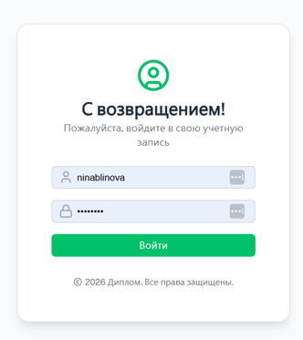
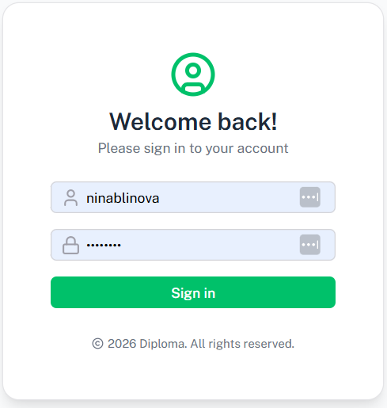
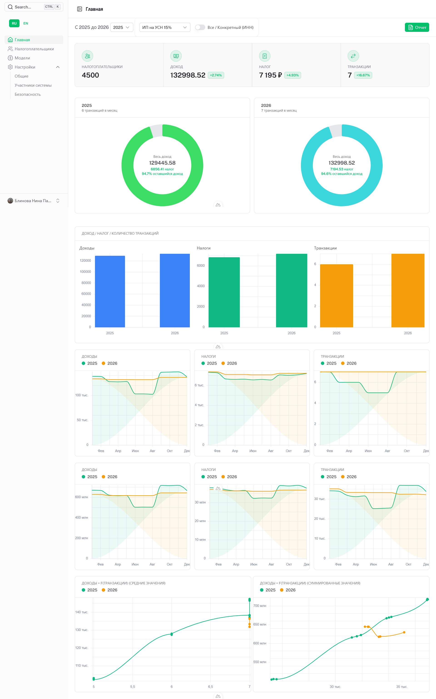
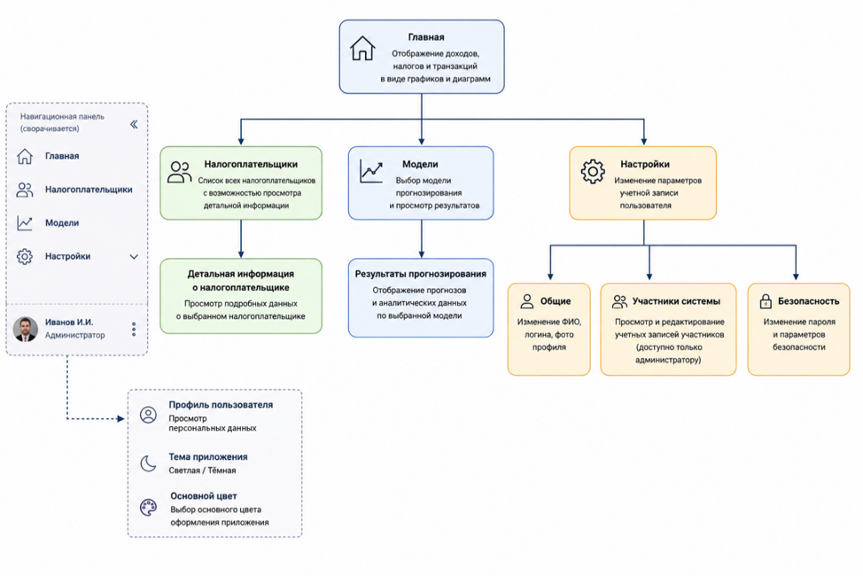
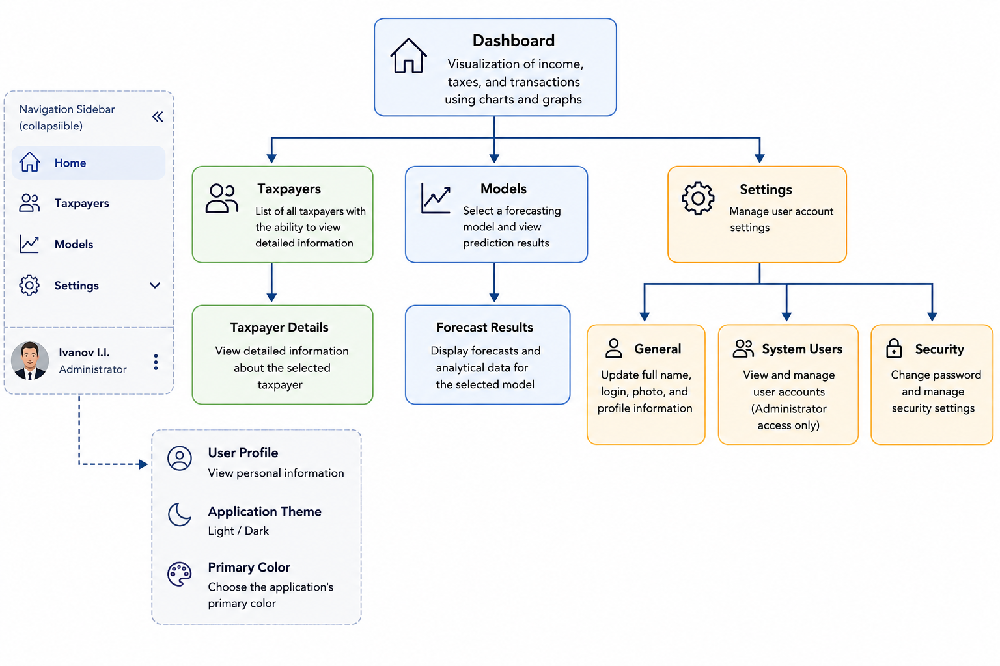
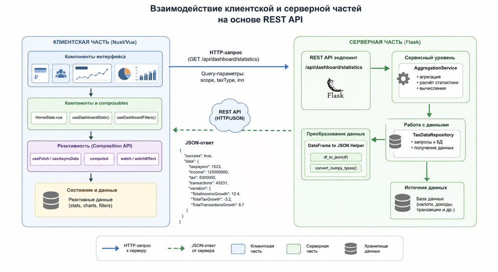
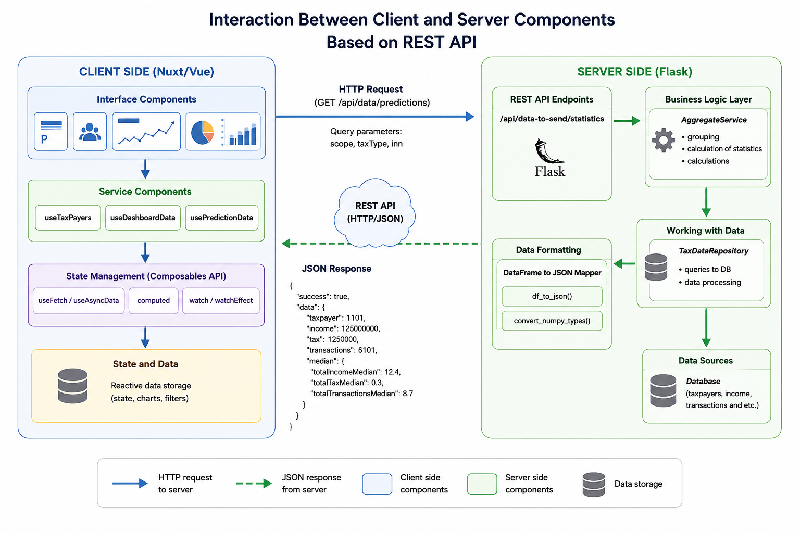

# My Dashboard — Tax Revenue Analytics & Forecasting

A web dashboard for analyzing and forecasting tax revenue dynamics of self-employed individuals (NPD) and sole proprietors (IP) in Russia, built as the frontend of a bachelor's thesis (VKR) project.

> **Scope note:** the system is built around the taxation rules of the **Russian Federation** (self-employment tax, USN, OSNO, patent regimes for sole proprietors), and all monetary values shown in the interface and reports are in **Russian rubles (RUB)**.

This repository contains the client application only. It communicates with a separate [Flask backend](https://github.com/NinaBlinova/DiplomaProject.git) that handles authentication, data aggregation, and the machine learning forecasting service ([LinearRegression, LightGBM, XGBoost]).

## Screenshots

<h3 align="center">Login Screen</h3>

<p align="center">
  
  
</p>

<p align="center">
  <em>Figure 1. Login screen of the web application (Russian and English interfaces).</em>
</p>

<h3 align="center">Dashboard Screen</h3>

<p align="center">
  
  
</p>

<p align="center">
  <em>Figure 2. Dashboard screen of the web application (Russian and English interfaces).</em>
</p>

## User interface

### Navigation

<p align="center">
  
  
</p>

<p align="center">
  <em>Figure 3. Navigation graph of the web application (Russian and English languages).</em>
</p>

The sidebar gives quick access to the main sections of the app:

- **Home** — income, tax, and transaction dynamics as charts and diagrams.
- **Taxpayers** — a list of all taxpayers with a detail view for each.
- **Models** — selection of the active forecasting model.
- **Settings** — account and system configuration, split into three subsections:
  - **General** — edit full name, username, and profile photo.
  - **Members** *(admin only)* — view and edit system members' accounts.
  - **Security** — change password.

The sidebar can be resized or collapsed to widen the working area.

At the bottom of the sidebar, the current user's photo and name are shown. Clicking the photo opens a menu with links to the user's profile, a light/dark theme switch, and an accent color picker.

### Key screens

- **Login** — username/password form with input icons styled to match the app; on success the user is redirected to the dashboard.
- **Dashboard (home)** — the main analytics screen. A filter bar at the top lets the user pick a date range, tax type, and scope (all taxpayers or a single one by INN). Below it, summary cards show each metric's average value and its percentage change versus the previous year. Further down, charts break the same data into donut charts (average tax share of income), bar charts (year-over-year comparison), line charts (overall and median dynamics), and an income-vs-transactions correlation chart.
- **Models** — a list of available ML models, each showing its version, creation date, and quality metrics (R², MAE, RMSE) split by category (tax, transactions, income). The active model is highlighted, and any model can be set as active.

## Architecture

<p align="center">
  
  
</p>

<p align="center">
  <em>Figure 4. Client–server interaction scheme based on REST API (Russian and English languages).</em>
</p>

The client (Nuxt) and server (Flask) communicate over REST: the client sends HTTP requests to server endpoints and the server responds with JSON. On the client, reactivity is handled by Nuxt's Composition API primitives (`useFetch`, `useAsyncData`, `computed`, `watch`), so changing a filter automatically triggers a new request and re-renders the affected charts without a full page reload.

## Features

- **Dashboard** — income, tax, and transaction dynamics as line charts, donut charts, and bar charts, plus an income-vs-transactions correlation chart, all computed for median and total values across taxpayers.
- **Filtering** — by date range/period, tax regime, and scope (all taxpayers or a single one by INN).
- **Taxpayers** — searchable table of taxpayers with a detail view (passport data, registration address, employee count) and add/delete actions.
- **Forecasting models** — browse available ML models with quality metrics (R², MAE, RMSE) and switch the active model used for predictions.
- **Report generation** — export the currently displayed dashboard data as a `.docx` report.
- **Settings** — profile editing, avatar upload, password change, and (for admins) managing system members and their access.
- **Internationalization** — Russian and English UI via `@nuxtjs/i18n`.
- **Light/dark theme** and adjustable accent color.

## Tech stack

- [Nuxt 4](https://nuxt.com/) + TypeScript
- [Nuxt UI](https://ui.nuxt.com/) for interface components
- [Unovis](https://unovis.dev/) for interactive charts
- [@nuxtjs/i18n](https://i18n.nuxtjs.org/) for localization
- [Tailwind CSS](https://tailwindcss.com/)

## Project structure

```
app/
├── components/       # UI components (home dashboard, taxpayers, models, settings...)
├── composables/       # Reusable client-side logic (filters, stats, auth, report generation)
├── layouts/           # Application layout (sidebar, navbar)
├── middleware/         # Route guards (auth)
├── modals/            # Modal dialogs (register user, edit user, user logs)
├── pages/             # File-based routes (/, /login, /models, /profile, /taxpayers, /settings/*)
├── types/             # Shared TypeScript types
└── utils/             # Helper utilities
server/
└── api/               # Nuxt server routes proxying requests to the Flask backend
i18n/
└── locales/           # ru.json / en.json translation files
```

## Getting started

### Prerequisites

- Node.js
- npm
- A running instance of the [backend service](#) (the app expects it at the URL configured below)

### Installation

```bash
npm install
```

### Configuration

The backend URL is set via `runtimeConfig.public.backendUrl` in `nuxt.config.ts` (defaults to `http://localhost:5002`). Override it with an environment variable if needed:

```bash
NUXT_PUBLIC_BACKEND_URL=http://localhost:5002
```

### Run in development

```bash
npm run dev
```

The app will be available at `http://localhost:3000`.

### Other commands

```bash
npm run build       # production build
npm run preview     # preview the production build
npm run lint        # lint the codebase
npm run typecheck   # run TypeScript type checking
```

## Related repositories

- Backend (Flask + ML forecasting service): *link here*

## About

This repository contains the frontend application developed as part of a bachelor's thesis on the analysis and forecasting of tax revenue dynamics for self-employed individuals and sole proprietors using machine learning techniques.
